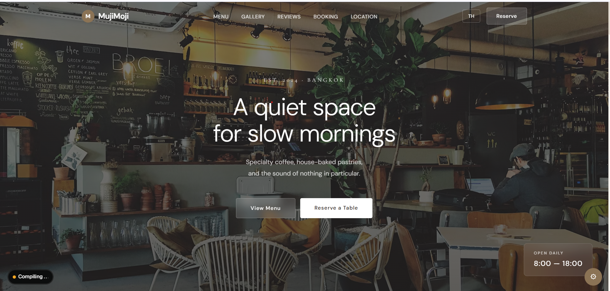

# MujiMoji Café

> A bilingual full-stack café website with an integrated table reservation system — built with Next.js 16 and .NET 10.




---

## Overview

MujiMoji Café is a specialty coffee shop website with a real, persisted table reservation system. The project covers the full stack — a Next.js frontend with Thai/English bilingual support wired to an ASP.NET Core REST API backed by SQLite via Entity Framework Core.

Built as a portfolio project to demonstrate production-oriented patterns: EF Core migrations, CORS hardening, input validation, Server Components, and runtime theme switching.

---

## Features

- **Bilingual UI** — English and Thai, switchable at runtime with Noto Sans Thai for correct Thai typography
- **Menu** — categorized (Coffee / Tea / Bakery / Signature) with client-side filtering
- **Table Reservation** — form with Thai phone validation, persisted to SQLite via REST API
- **Theme Switcher** — 3 color themes (Warm / Forest / Dark) and 3 hero layout variants, toggled without page reload using CSS variables
- **Loading Skeletons** — Suspense-based placeholders for all async sections
- **Gallery & Reviews** — customer testimonials and café photo gallery
- **Responsive** — mobile-first layout with Tailwind CSS

---

## Tech Stack

| Layer | Technology |
|---|---|
| Frontend | Next.js 16, React 19, TypeScript 5, Tailwind CSS 4 |
| Backend | .NET 10, ASP.NET Core Web API, C# |
| ORM | Entity Framework Core 10 (SQLite provider, code-first migrations) |
| Database | SQLite |
| Testing | Playwright |
| Fonts | DM Sans, Cormorant Garamond, Noto Sans Thai |

---

## Architecture

```
Browser
  └── Next.js App Router (port 3000)
        ├── Server Components (default) — layout, static sections
        ├── Client Components ('use client') — booking form, theme switcher, menu filter
        └── Context API — language & theme state
              │
              └── REST API (port 5249)
                    └── ASP.NET Core Controllers
                          └── EF Core DbContext → SQLite (mujimoji.db)
```

**Frontend conventions:**
- Server Components by default; `'use client'` only for interactivity
- `AppContext` manages language (`en` / `th`) and active theme globally
- All bilingual strings live in `frontend/lib/translations.ts`
- CSS custom properties drive theme switching — no JS per render

**Backend conventions:**
- Single `BookingsController` exposes 3 endpoints
- EF Core migrations run automatically on startup (`MigrateAsync()` in `Program.cs`)
- `AsNoTracking()` on all read-only queries

---

## API Reference

Base URL: `http://localhost:5249`

| Method | Endpoint | Description |
|---|---|---|
| `POST` | `/api/bookings` | Create a reservation |
| `GET` | `/api/bookings` | List all reservations (newest first) |
| `GET` | `/api/bookings/{id}` | Get a single reservation |

**Booking fields:** `name` (max 100), `phone` (Thai format `0XXXXXXXXX`), `date` (YYYY-MM-DD), `time` (HH:mm), `guests` (1–20), `note` (optional, max 500).

---

## Getting Started

**Prerequisites:** Node.js 20+, .NET 10 SDK

```bash
# 1. Start the backend (runs EF migrations automatically)
cd backend/MujiMoji.Api
dotnet run
# API available at http://localhost:5249

# 2. Start the frontend (new terminal)
cd frontend
cp .env.example .env.local   # sets NEXT_PUBLIC_API_URL
npm install
npm run dev
# App available at http://localhost:3000
```

The SQLite database file is created at `backend/MujiMoji.Api/mujimoji.db` on first run.

---

## What I Learned

- **EF Core migrations** — code-first schema management with meaningful migration names, and why you never edit a migration after it's applied
- **Thai encoding in Next.js** — non-ASCII characters in TypeScript template literals corrupt in esbuild on Windows; the fix is `\uXXXX` escapes in TS and `&#xXXXX;` in HTML text nodes (separate `.html` files are safe)
- **CORS configuration** — explicit `AllowedOrigins` list in `appsettings.json` instead of wildcards; reading origins from config rather than hardcoding them
- **Bilingual architecture** — centralising all copy in a typed `translations.ts` object makes language switching a context lookup rather than scattered conditional rendering
- **CSS variable theming** — switching themes via `document.documentElement.style.setProperty` keeps the bundle small and avoids re-renders

---

## Project Structure

```
muji-moji/
├── frontend/
│   ├── app/                  # Next.js App Router (layout, page, globals.css)
│   ├── components/           # Nav, Hero, MenuSection, BookingSection, TweaksPanel …
│   ├── context/AppContext.tsx # Language & theme state
│   ├── lib/translations.ts   # All EN/TH copy (~12 KB)
│   └── .env.example
└── backend/
    └── MujiMoji.Api/
        ├── Controllers/BookingsController.cs
        ├── Models/Booking.cs
        ├── Data/AppDbContext.cs
        ├── Migrations/
        └── Program.cs
```

---

---

## ภาษาไทย

# MujiMoji Café

เว็บไซต์ร้านกาแฟแบบ Full-Stack พร้อมระบบจองโต๊ะ รองรับสองภาษา (ไทย / อังกฤษ) — สร้างด้วย Next.js 16 และ .NET 10

---

## ภาพรวม

MujiMoji Café เป็นเว็บไซต์ร้านกาแฟที่มีระบบจองโต๊ะจริง พร้อมบันทึกข้อมูลลงฐานข้อมูล ครอบคลุมทั้ง Frontend ด้วย Next.js ที่รองรับภาษาไทย/อังกฤษ เชื่อมต่อกับ ASP.NET Core REST API และ SQLite ผ่าน Entity Framework Core

สร้างขึ้นเพื่อแสดง Pattern การพัฒนาที่ใกล้เคียง Production: EF Core Migrations, CORS Hardening, Input Validation, Server Components และการสลับธีมแบบ Real-time

---

## ฟีเจอร์หลัก

- **UI สองภาษา** — ไทยและอังกฤษ สลับได้ทันทีพร้อม Noto Sans Thai สำหรับตัวอักษรไทยที่ถูกต้อง
- **เมนู** — แยกหมวดหมู่ (กาแฟ / ชา / เบเกอรี่ / Signature) กรองได้ฝั่ง Client
- **จองโต๊ะ** — ฟอร์มพร้อม Validation เบอร์โทรไทย บันทึกลง SQLite ผ่าน REST API
- **สลับธีม** — 3 ธีมสี (Warm / Forest / Dark) และ 3 รูปแบบ Hero สลับได้โดยไม่โหลดหน้าใหม่ ด้วย CSS Variables
- **Loading Skeletons** — Placeholder แบบ Suspense สำหรับ Section ที่โหลด Async ทุกส่วน
- **Gallery และ Reviews** — รีวิวลูกค้าและรูปบรรยากาศร้าน
- **Responsive** — ออกแบบ Mobile-first ด้วย Tailwind CSS

---

## Tech Stack

| Layer | Technology |
|---|---|
| Frontend | Next.js 16, React 19, TypeScript 5, Tailwind CSS 4 |
| Backend | .NET 10, ASP.NET Core Web API, C# |
| ORM | Entity Framework Core 10 (SQLite, Code-First Migrations) |
| Database | SQLite |
| Testing | Playwright |
| Fonts | DM Sans, Cormorant Garamond, Noto Sans Thai |

---

## วิธีรันในเครื่อง

**ต้องการ:** Node.js 20+, .NET 10 SDK

```bash
# 1. เริ่ม Backend (รัน EF Migrations อัตโนมัติ)
cd backend/MujiMoji.Api
dotnet run
# API: http://localhost:5249

# 2. เริ่ม Frontend (Terminal ใหม่)
cd frontend
cp .env.example .env.local
npm install
npm run dev
# App: http://localhost:3000
```

ไฟล์ SQLite จะถูกสร้างที่ `backend/MujiMoji.Api/mujimoji.db` ในการรันครั้งแรก

---

## สิ่งที่ได้เรียนรู้

- **EF Core Migrations** — การจัดการ Schema แบบ Code-First พร้อมเหตุผลว่าทำไมถึงไม่ควรแก้ Migration หลังจาก Apply แล้ว
- **การ Encode ภาษาไทยใน Next.js** — ตัวอักษร Non-ASCII ใน TypeScript Template Literals จะเสียหายใน esbuild บน Windows วิธีแก้คือใช้ `\uXXXX` ใน TS และ `&#xXXXX;` ใน HTML Text Nodes
- **CORS Configuration** — ใช้ `AllowedOrigins` ที่ระบุชัดเจนใน `appsettings.json` แทนการใช้ Wildcard
- **Bilingual Architecture** — รวม Copy ทั้งหมดไว้ใน `translations.ts` แบบ Typed ทำให้การสลับภาษาเป็นแค่การ Lookup ใน Context
- **CSS Variable Theming** — สลับธีมผ่าน `document.documentElement.style.setProperty` ทำให้ Bundle เล็กและไม่ Re-render

---

*สร้างโดย Kew — 2026*
